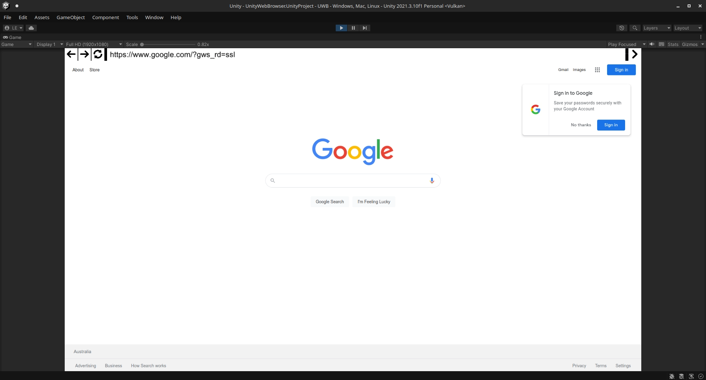
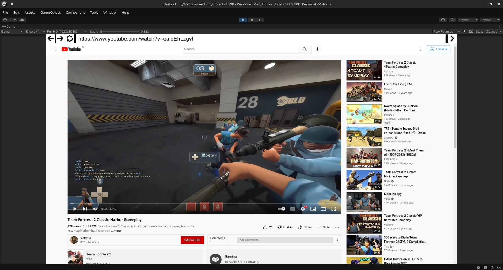
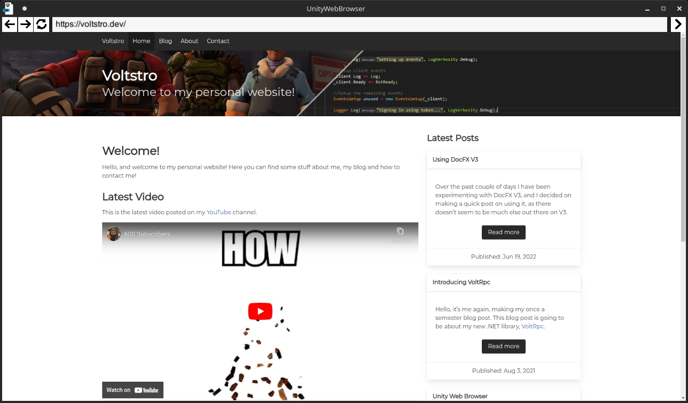

# Unity Web Browser

[](/LICENSE.md)
[](https://github.com/Voltstro-Studios/UnityWebBrowser/actions/workflows/main.yml)
[](https://projects.voltstro.dev/UnityWebBrowser/latest/)

Unity Web Browser (UWB) is a Unity package that allows displaying and interacting with the web from within Unity.

This project is capable of using any desired web engine you want, however for now we only have an engine using [CEF](https://bitbucket.org/chromiumembedded/cef/).

## Features

- Easy Installation with UPM
- Multi-Platform Desktop Support (Windows, Linux & MacOS)
- API to interact with the web engine
- JS Interop
- Extendable
- 100% Open-Source

## Getting Started

### Prerequisites

```
Unity 2021.3.x
```

### Install

1. Setup [VoltUPM](https://github.com/Voltstro/VoltstroUPM#setup)
2. Define the additional scopes `org.nuget` and `com.cysharp.unitask` with VoltUPM
3. Install UnityWebBrowser packages

For a more in-depth installation guide, check out the [setup article](https://projects.voltstro.dev/UnityWebBrowser/latest/articles/user/setup/).

## Documentation

For further documentation, see [UWB's project site](https://projects.voltstro.dev/UnityWebBrowser/latest/articles/).

The project site covers information such as Engines, Platform support, advance setup, plus more.

## Issues/Features Requests/Questions (Support)

With issues, please use the [GitHub issue tracker](https://github.com/Voltstro-Studios/UnityWebBrowser/issues).

With feature requests and questions, please use [GitHub Discussions](https://github.com/Voltstro-Studios/UnityWebBrowser/discussions).

Before opening a new issue/discussion, make sure someone else hasn't already asked.

PLEASE DO NOT USE DISCORD FOR SUPPORT!

## Contributing

We will gladly accept contributions from anyone!

Contributions don't just have to be code, contributions can be good [bug reports](https://github.com/Voltstro-Studios/UnityWebBrowser/issues), good [questions/feature requests](https://github.com/Voltstro-Studios/UnityWebBrowser/discussions), or even simple updates to our docs.

But, if you do wish to contribute code wise to project, please see the [dev docs](https://projects.voltstro.dev/UnityWebBrowser/latest/articles/dev/dev-guide/) for setting up the project. Pickup a feature request or bug report, do the required changes then submit a PR to the `master` branch for review.

## Screenshots

<details>
  <summary>Click to expand!</summary>

### [Editor] Google



### [Editor] YouTube



### [Editor] Reddit Old

(Note: New Reddit works fine as well!)


### [Player] Voltstro's Website



</details>

## Authors

* **Voltstro** - *Initial work* - [Voltstro](https://github.com/Voltstro)

## License

This project is licensed under the MIT License - see the [LICENSE.md](/LICENSE.md) file for details.

## Socials

Here are our socials, please don't use these for support!

[](https://discord.voltstro.dev)

[](https://twitter.com/Voltstro)

[](https://twitter.com/VoltstroStudios)

## Thanks

Thank you to many different projects and people that have made this project possible.

### CEF Engine

This projects were used as inspiration/how-to for the CEF Engine.

- [CEF](https://bitbucket.org/chromiumembedded/cef/src/master/) - Underlying web engine.
- [CefGlue](https://gitlab.com/xiliumhq/chromiumembedded/cefglue) - C# wrapper.
- [CefUnitySample](https://github.com/aleab/cef-unity-sample) - CEF directly in Unity. Has crashing problems tho.
- [unity_browser](https://github.com/tunerok/unity_browser) - (Orginally by Vitaly Chashin) CEF working in Unity using IPC, but the project is in a messy state.
- [ChromiumGtk](https://github.com/lunixo/ChromiumGtk) - Linux stuff with CEF