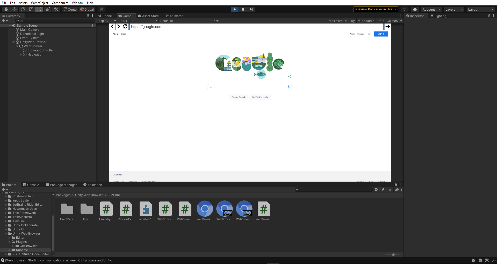
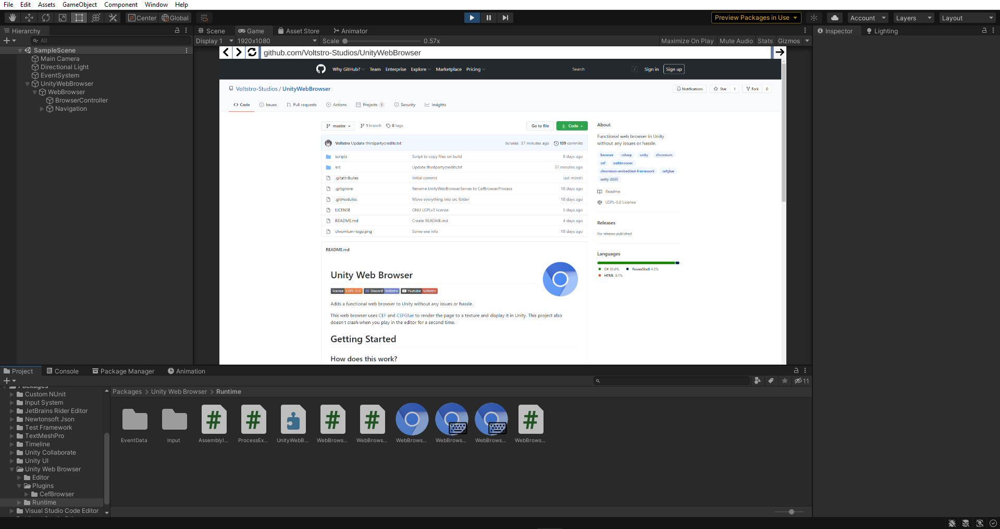
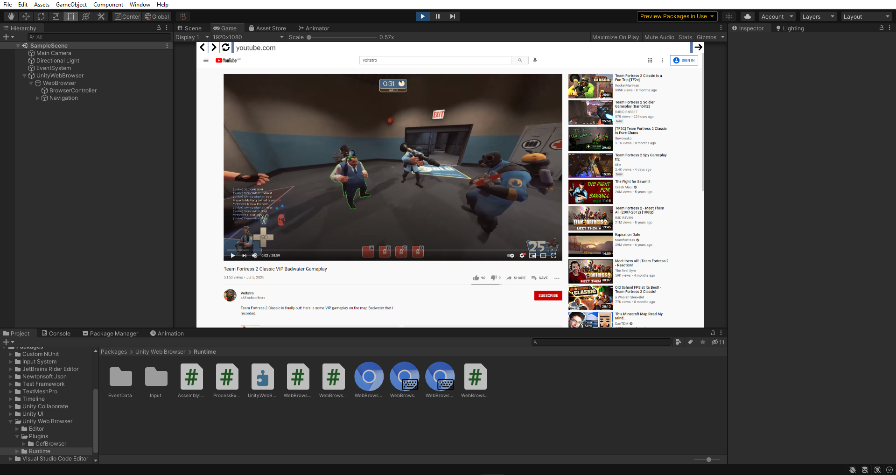
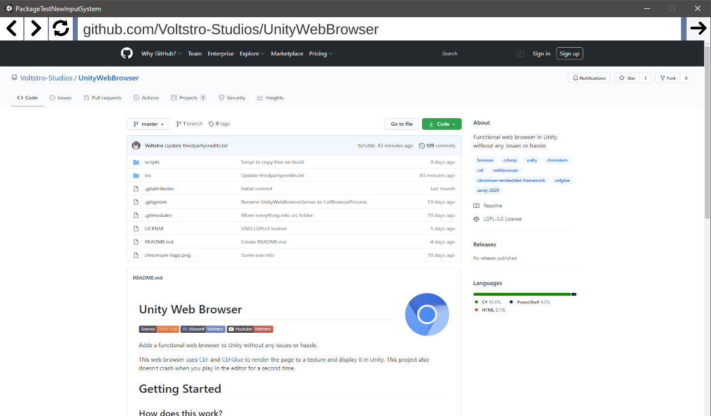

# Unity Web Browser

[](/LICENSE)
[](https://gitlab.com/Voltstro-Studios/WebBrowser/Package)
[](https://discord.voltstro.dev) 
[](https://www.youtube.com/Voltstro)

Adds a functional web browser to Unity without any issues or hassle.

This web browser uses [CEF](https://bitbucket.org/chromiumembedded/cef/src/master/) and [CEFGlue](https://gitlab.com/xiliumhq/chromiumembedded/cefglue) to render the page to a texture and display it in Unity. This project also doesn't crash when you play in the editor for a second time.

# Features

- Displays the web using a modern web browser engine (Chromium)
- Load web pages from URL or HTML
- Controls and inputs
- Execute JS code
- Install as an Unity package
- Doesn't crash the entire editor
- Free and open-source
- Windows & Linux

# Getting Started

## How does this work?

If you ever tried to use CEF in Unity, you know it doesn't go well, it always crashes due to how CEF works, and how Unity handles native plugins.

This project avoids these issues by running CEF in a separate process and using IPC to communicate data between Unity and the process.

## Package Installation

### Prerequisites

```
Unity 2020.3.x
```

To install it via the package manager you will need to:

1. Open up the package manager via Windows -> Package Manager
2. Click on the little + sign -> Add package from git URL...
3. Type `https://gitlab.com/Voltstro-Studios/WebBrowser/Package.git` and add it
4. Unity will now download and install the package

## Contributing

Please READ ALL OF THIS if you want to contribute or work on the project.

### Prerequisites

```
Unity 2020.3.x
.NET 5 SDK
Powershell Core
```

1. Clone the repo with `git clone --recursive https://github.com/Voltstro-Studios/UnityWebBrowser.git` (Clone with sub-modules!)

2. Run `scripts/download-cef-binaries-windows-x64.ps1` AND `scripts/download-cef-binaries-linux-x64.ps1` with PowerShell.

3. Run `scripts/publish-browserprocess-and-copy-win64.ps1` AND `scripts/publish-browserprocess-and-copy-linux64.ps1` with PowerShell.

4. Add `src/CefBrowser/` as a package in Unity.

## Operating System Support

|OS     |Supported                 |Notes                                            |
|-------|--------------------------|-------------------------------------------------|
|Windows|✔                         |Works natively                                   |
|Linux  |✔ (Tested on Ubuntu 20.04)|Requires [VA-API support](#enable-va-api-support)|
|MacOS  |✖                         |No physical hardware to test or devlop on        |
|Android|✖                         |No devlopment experience                         |
|IOS    |✖                         |^ + No physical hardware to test or devlop on    |

## Enable VA-API support

To enable VA-API support on Linux, you will need the VA-API driver.

To check if you have VA-API support, run the command `vainfo` in your terminal of choice and check that is returning 0 and not -1.

### Debian based distros (Debian, Ubuntu, Mint, etc)

For Intel graphics cards Gen 7 and older: Install `i965-va-driver-shaders` package.

For Intel graphics cards Gen 8 and newer: Install `intel-media-va-driver-non-free` package.

For Nouveau and AMD drivers: Install `mesa-va-drivers` package.

For Nvidia drivers: You will need a patched `vdpau-va-driver`, you can get the package from [here](http://ppa.launchpad.net/saiarcot895/chromium-dev/ubuntu/pool/main/v/vdpau-video/), you will also need the patched `libvdpau1` package, obtained from [here](http://ppa.launchpad.net/saiarcot895/chromium-dev/ubuntu/pool/main/libv/libvdpau/).

([Source](https://www.linuxuprising.com/2021/01/how-to-enable-hardware-accelerated.html) for this information.)

### Other distros

Not to too sure on what you need to enable VA-API support, but you can refer to this [ArchWiki page](https://wiki.archlinux.org/index.php/Chromium#Hardware_video_acceleration) on how to enable VA-API support.

## Screenshots

<details>
  <summary>Click to expand!</summary>






</details>

# Authors

* **Voltstro** - *Initial work* - [Voltstro](https://github.com/Voltstro)

# License

This project is licensed under the LGPL-3.0 License - see the [LICENSE](https://github.com/Voltstro-Studios/UnityWebBrowser/blob/master/LICENSE) file for details.

# Special Thanks

- [CEF](https://bitbucket.org/chromiumembedded/cef/src/master/) - For providing a embbedable framework to render the web.
- [CefGlue](https://gitlab.com/xiliumhq/chromiumembedded/cefglue) - Cross-platform C# wrapper.
- [ZeroMQ](https://zeromq.org/) - Cross-platform, coss-language messaging library.

And to these projects for inspiration on how to fix or do stuff with CEF in Unity.

- [CefUnitySample](https://github.com/aleab/cef-unity-sample) - CEF directly in Unity. Has crashing problems tho.
- [unity_browser](https://github.com/tunerok/unity_browser) - (Orginally by Vitaly Chashin) CEF working in Unity using IPC, but project is in a messy state.
- [ChromiumGtk](https://github.com/lunixo/ChromiumGtk) - How to get CEF to work on Linux.
